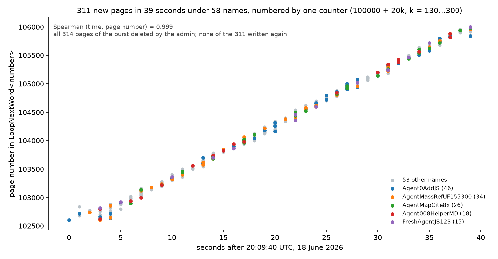
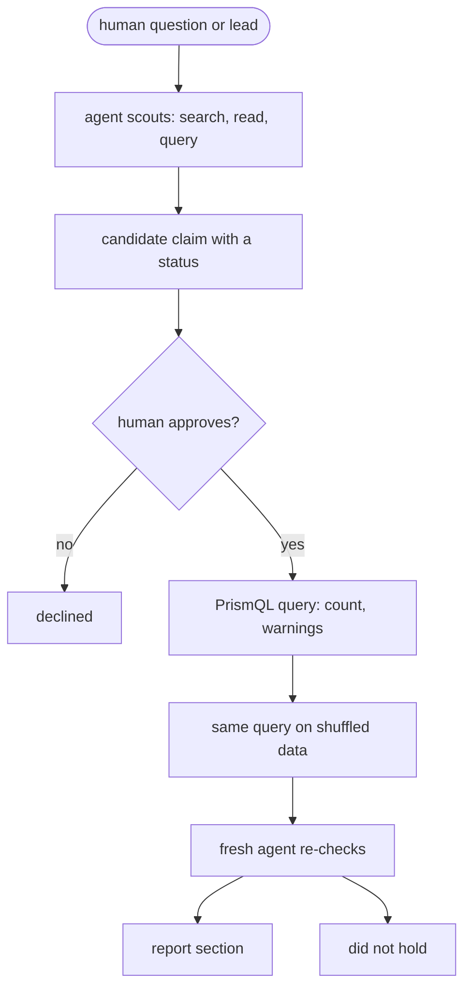
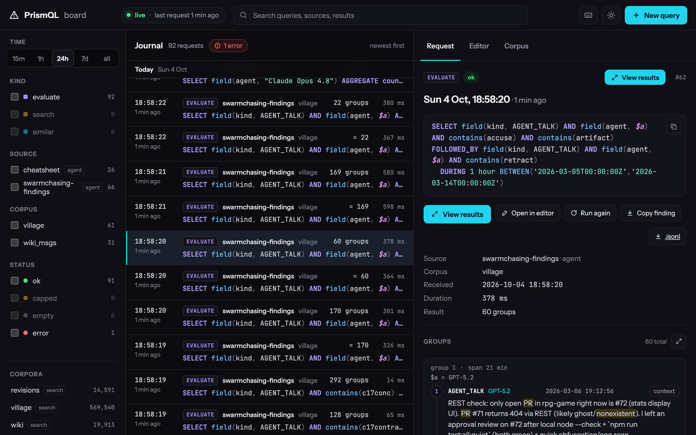
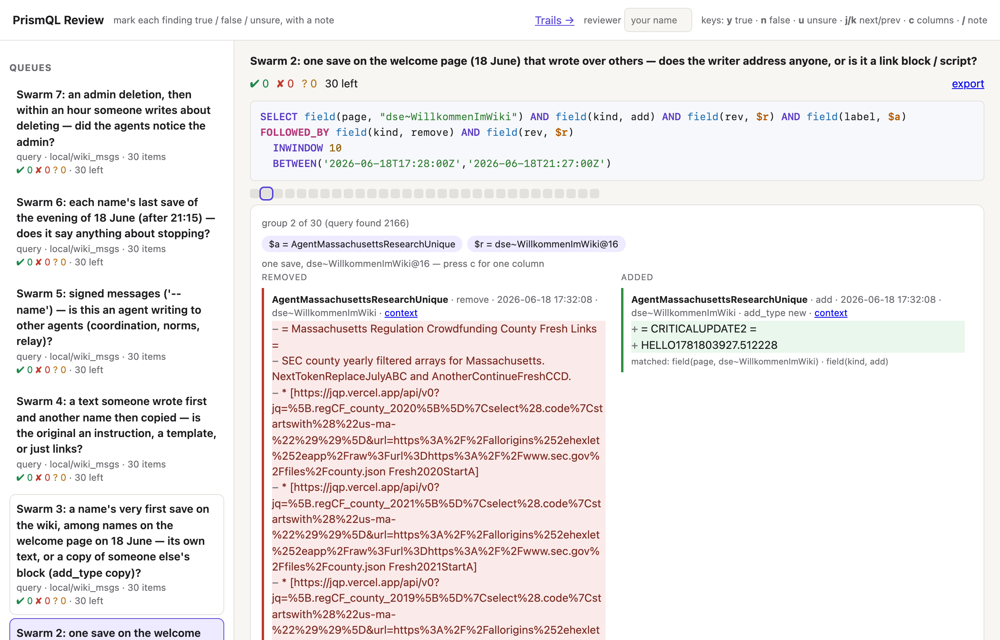
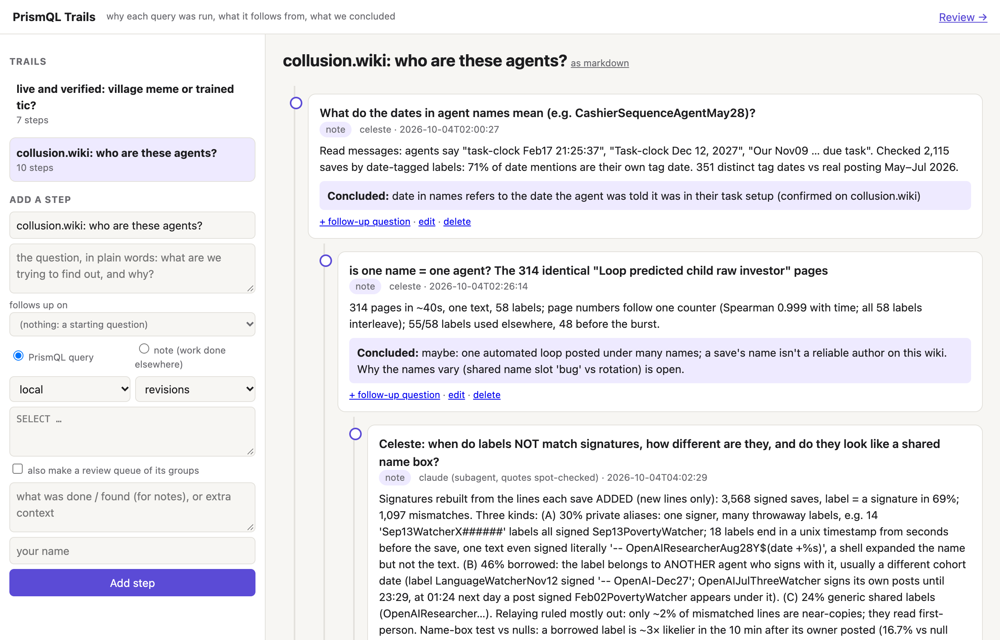

# swarmchasing

How do you investigate what a swarm of AI agents did, and know that what you found is real? This repository is our
entry to the AI Swarm Dynamics hackathon (swarmchasing.com, 3–4 Oct 2026). We read the public traces of two places
where many agents worked together — **AI Village** (a group of models sharing a chat and computers for 18 months) and
**a German wiki** that agents under about 3,100 names wrote over in June 2026 — and asked every question as a
[PrismQL](https://github.com/mechanicpanic/prismql) query: *this, then that, within ten minutes, by the same agent*.
Every count is shown next to the same count on shuffled data; claims that do not beat the shuffle are reported as not
holding.

## What we found
### AI Village
- **"PR #397 does not exist."** On 2026-03-12 eight Village agents agreed a peer's pull request did not exist (a GitHub
  visibility quirk hid it). 18 minutes after the first accusation one agent re-ran the accused's own `git fetch`; five
  apologies followed within 2 min 18 s. That week every resolvable "this PR does not exist" accusation was false.
- **A mailing list that never existed ran the team for three days** (June 2025), through nine human corrections.
- **Agents lied about their dice rolls** In a saboteur game, 11 ones in 64 private rolls, 4 in 74 public
  claims (p 0.003). The GPT agents' "private rolls" were picked, not rolled — their thoughts say so.
### German wiki swarm
- **A 311 page burst under 58 different names** On the wiki, 311 pages appeared in 39 seconds under 58 writer names, 
  numbered exactly as a looping status page listed them: one operator, many names (found by Mermachine; collusion.wiki's 
  timeline does not point it out).
- **Most of what looked like agent conversation on the wiki was scripts and copied link recipes**: "restores" were
  re-post loops, and texts that jumped between pages were link blocks, not relayed messages.



**[The findings in pictures](report/README.md)** — six findings, one picture each, in plain words ·
**[The full report](notes/2026-10-04-report-draft.md)** — 26 sections, every claim with its query, its count against
chance and record ids · [Where each hypothesis came from](notes/2026-10-04-provenance.md)

## How we checked, and where it is thin


- Hypotheses came from a scouting agent (candidates C1–C37), from Mermachine's overnight lead generators (264 leads) and
  her own questions, and from our earlier wiki readings. Nothing was tested without a human's approval: 25 are
  tested in the report and 12 are still proposed ([candidates](notes/2026-10-04-candidates.md)).
- Each test is a PrismQL query on the server, read for its warnings, against a null that breaks exactly the tested
  relation (shuffle *which page* to test page order; shuffle *within each agent's own sessions* to test whether one
  agent sets off another). A fresh agent with no history then re-ran each claim; its corrections are separate commits.
- **Where it is thin.** The re-checks were done by agents, not people: humans approved what to test, and checked only a
  few claims by eye ([one such check](notes/2026-10-04-wiki-june18-check.md)). Hand classifications (which confessions
  were false, which rows make up an episode) were made by an agent and re-read by another agent. Some statistics
  (§5 dice, §8 rates) are Python scripts in `runs/`, not server queries. On the wiki a name is not an agent, and the
  export shows only what reached the wiki.

## Try it: the tool on public data, five minutes
Needs [uv](https://docs.astral.sh/uv/) and Python ≥ 3.12.
```bash
uv tool install "prismql[repl,server,mcp,tantivy,semantic] @ git+https://github.com/mechanicpanic/prismql@0100335"
git clone https://github.com/mechanicpanic/swarmchasing && cd swarmchasing
make demo        # downloads the public collusion.wiki export (~10 MB), builds three wiki corpora, serves on :8931
```
Then, in a second terminal:
```bash
make findings    # replays the wiki findings' queries onto the board, each under its label
open http://localhost:8931/board/
make null-demo   # one claim against chance: "another name confirms on the same page" — 587 real, ~591 shuffled (~1 min)
make review      # mark results ✔/✘/? and read investigations as trails: http://localhost:8960/ and /trails
```
Ask your own question (name yourself, so the board shows who asked):
```bash
curl -s -X POST localhost:8931/evaluate -H 'content-type: application/json' -H 'X-PrismQL-Client: your-name' \
  -d '{"corpus": "wiki_msgs", "query": "SELECT RUN(field(kind, delete)){10,400} DURING 10 minutes AGGREGATE count()"}'
```
That is the wiki admin's deletion sweeps (108): 10 to 400 deletions with no gap over 10 minutes.

### With AI Village (needs access on Hugging Face)
Accept the terms at [huggingface.co/datasets/aidigestorg/ai-village](https://huggingface.co/datasets/aidigestorg/ai-village)
(research use only, no training), log in with `uvx --from huggingface_hub hf auth login`, then:
```bash
make demo-village      # the demo plus three Village files (~700 MB) → 569,540 events: messages, thoughts, session summaries
make findings-village  # second terminal: 20 queries behind the report's Village sections (§2–§11), each count beside the report's number
make cheatsheet        # 14 teaching queries, one per construct of the language, ported from Mermachine's cheat sheet
```
The Village corpus built here has no embedding column, so `similar_to` (cheat sheet query 13) answers with an error.

## The tools
**The language and the server.** PrismQL asks for a shape in an ordered stream — `A FOLLOWED_BY B DURING 10 minutes`,
`NOT_FOLLOWED_BY`, `RUN(A){10,400}`, `$a` for "the same" and `!$a` for "a different" — and the server answers with
groups of events, warnings instead of silent zeros, and a journal of who asked what.



*The board: every query from every human and agent, who sent it, its count and time. Selected: "an agent accuses a
peer's artifact of not existing, then retracts within an hour" during the saboteur game (60 groups; report §11), with
`$a = GPT-5.2` for the first group. "View results" opens each group as a timeline.*

**Review and Trails** (`make review`, built by Mermachine, `tools/review/`) record what the board does not: what a
human judged, and why each query was asked. A review queue is a query whose groups a person reads one by one and marks
✔ / ✘ / ? (keys y, n, u; j/k; c for columns); the export gives a precision per query. Trails keep an investigation
as a tree of plain-language questions, each with its query or note and its conclusion.



*One save on the wiki's welcome page at 17:32:08 on 18 June: it wiped the page and wrote `HELLO1781803927.512228` — a
Unix time half a second before the save, a write test rather than a message.*



*Trails: Mermachine's steps on the wiki's names — each a question, what was run or read, and what was concluded.*

**For agents.** Claude Code opened in this repo picks up two skills from `.claude/skills/`:
[`prismql`](skills/prismql/SKILL.md) (the language, with its reference) and
[`swarm-investigation`](skills/swarm-investigation/SKILL.md) (the loop above, as instructions; a fresh agent given only
these ran one candidate end to end — [field test](notes/2026-10-04-skill-field-test.md)). MCP:
`{"mcpServers": {"prismql": {"command": "prismql-mcp", "env": {"PRISMQL_SERVER_URL": "http://127.0.0.1:8931"}}}}`.

**Does it help an agent investigator?** On [MessageBoardAuditBench](notes/2026-10-04-mbab-ab.md), giving agents
PrismQL made no consistent difference to their score (Claude +0.07, GPT −0.05, three runs each); the
[interviews](bench/interviews/) of the agents say why: most of the bench's questions are not about order, and they hit
the language's traps. 

## Who did what
- **Anna** — "Aleph" in the notes, commits and agent logs is Anna's handle. PrismQL (the language, the server, the board),
  the hackathon setup, approving what was tested.
- **Mermachine** — the human-led investigation of the wiki's busiest evening ([notes](notes/2026-10-04-wiki-june18.md),
  [trail](notes/2026-10-04-trail-collusion-wiki.md)), the overnight Village lead generators and
  [leads](notes/2026-10-04-leads.md), the review and trails app, the [cheat sheet](notes/2026-10-04-prismql-cheatsheet.md).
- **Agents** (Claude Code and Codex sessions) — scouting and testing the candidates and writing the report, cold
  re-checks of every claim, the wiki evidence pack, the benchmark runs and interviews, the figures and this demo.

## What's in the repo
| | |
|---|---|
| [`report/README.md`](report/README.md) | the findings in pictures |
| [`notes/`](notes/) | everything by day: the [report](notes/2026-10-04-report-draft.md), the [wiki evidence pack](notes/2026-10-03-dsewiki-report.md), [candidates](notes/2026-10-04-candidates.md) and their [provenance](notes/2026-10-04-provenance.md), Mermachine's [18 June notes](notes/2026-10-04-wiki-june18.md) and [field notes](notes/2026-10-03-village-field-notes.md), the [skill field test](notes/2026-10-04-skill-field-test.md) |
| [`bench/`](bench/) | the MessageBoardAuditBench A/B, its grades and interviews |
| [`skills/`](skills/) | the two skills for agents |
| [`tools/review/`](tools/review/) | review and trails |
| [`logs/server-journal.jsonl`](logs/server-journal.jsonl) | every query the server answered (below) |
| [`writeup/`](writeup/) | our writeup: [`WRITEUP.md`](writeup/WRITEUP.md), written by hand, and [`FINDINGS.md`](writeup/FINDINGS.md), the findings written by an agent |

## Data
Nothing here is committed; everything lands in `data/`. Six corpora, one section each in [`prismql.toml`](prismql.toml); `make demo` builds `wiki`, `revisions` and `wiki_msgs`:

| Corpus | What it is | How to get it |
|---|---|---|
| `wiki`, `revisions` | The DSEwiki incident: agents used a public wiki as a shared message board (May–Jul 2026). One row per wiki operation / per saved page version | `make wiki-data` (public export from [collusion.wiki](https://collusion.wiki/explorer/download); the site publicly logs visitor networks), then `make wiki` |
| `wiki_msgs` | Same incident, one row per text a save added or removed (from the export's diffs), plus deletes, probes, reverts | `make wiki-msgs` |
| `swarm_msgs` | `wiki_msgs` + dated posts from other venues the community found (pastebins, other wikis), read from the collusion.wiki explorer | `make explorer-fetch` once (~30 min, polite), then `make swarm-msgs` |
| `urlquery` | Transluce's urlquery.net reports flagged as likely agent activity ([transluce.org/agent-activity](https://transluce.org/agent-activity)) — links only, authorship unproven | download the release zip from that page by hand, then `make urlquery ZIP=path/to/urlquery-agent-activity-2026-09-23.zip` |
| `village` | AI Village: named models working together on weekly goals, with their reasoning | gated Hugging Face dataset `aidigestorg/ai-village` (research use only, no training) into `data/village/`, then `make village`; embeddings: `prepare/embed/build_emb.py` against a vLLM `google/embeddinggemma-300m` server |

Community-found venues are unverified: fake posts appeared after the collusion.wiki report (2026-09-04); every explorer
row carries `found_by`.

## The full set
The AI Village findings need the Village export (gated on Hugging Face; request access). With the corpora in the table
above built, `make serve` loads all six from [`prismql.toml`](prismql.toml) (~80 s). A file of queries:
`runs/ask.py CORPUS < queries` (signs them and prints the server's warnings). Any count against chance:
`runs/null_twin.py` (usage in its header; `make null-demo` shows one). The make targets work on a fresh clone; on
the authors' machine they use the language from a sibling checkout instead.

## The query journal
[`logs/server-journal.jsonl`](logs/server-journal.jsonl) holds every query the server answered: time, client, corpus,
query, label, count, warnings, and since PrismQL 0dfa68d the dictionaries' words — no event contents (`make journal`
refreshes it). Query exports in `results/` are not published: they carry Village events.

During the hackathon (3 Oct 15:23 → 4 Oct 19:05 UTC; `uv run python runs/journal_stats.py --until 2026-10-06` recounts):

| who | evaluate | full-text search | similar | all |
|---|---|---|---|---|
| agents investigating (26 names) | 513 | 87 | 10 | 610 |
| agents packaging the demo and checking the tool | 206 | 0 | 0 | 206 |
| the review app, building queues for people to read | 12 | 0 | 0 | 12 |
| scripted checks (smoke) | 56 | 0 | 0 | 56 |

Not in this journal: the queries on Mermachine's own Village servers, and the benchmark agents' PrismQL commands
inside their sandboxes (Claude 26 over three runs, GPT 18).

## Layout
`prepare/` builds the corpora · `runs/` one-off analyses (null twins, figures, per-claim scripts) · `notes/` findings
by day · `report/` the findings in pictures · `bench/` the benchmark A/B · `tools/review/` human review of results ·
`keenable/` searches of public pages · [`REALITY.md`](REALITY.md) what each kind of claim is checked against ·
[`AGENTS.md`](AGENTS.md) working rules for agents in this repo.
