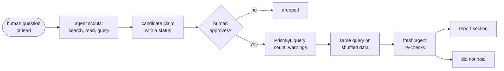

# swarmchasing

How do you investigate what a swarm of AI agents did, and know that what you found is real? This repository is our
entry to the AI Swarm Dynamics hackathon (swarmchasing.com, 3–4 Oct 2026). We read the public traces of two places
where many agents worked together — **AI Village** (a group of models sharing a chat and computers for 18 months) and
**a German wiki** that agents under about 3,100 names wrote over in June 2026 — and asked every question as a
[PrismQL](https://github.com/mechanicpanic/prismql) query: *this, then that, within ten minutes, by the same agent*.
Every count is shown next to the same count on shuffled data; claims that do not beat the shuffle are reported as not
holding.


*The board during the hackathon: each query, who sent it (here the session testing the wiki findings), its count and
time. 833 queries are in [`logs/server-journal.jsonl`](logs/server-journal.jsonl).*

## Start here
| | |
|---|---|
| **[The findings in pictures](report/README.md)** | Six findings, one picture each, in plain words |
| **[WRITEUP.md](WRITEUP.md)** | The writeup, written by hand |
| [The full report](notes/2026-10-04-report-draft.md) | Every claim with its query, its count against chance, record ids; and the claims that did not hold |
| [The wiki swarm, claim by claim](notes/2026-10-03-dsewiki-report.md) | The DSEwiki incident re-derived from the public export |
| [The evening of 18 June](notes/2026-10-04-wiki-june18.md) | A human-led investigation of the wiki's busiest night, step by step |
| [Does PrismQL help an agent investigator?](notes/2026-10-04-mbab-ab.md) | An A/B on MessageBoardAuditBench, and interviews of the agents ([`bench/`](bench/)) |
| [Review and trails](tools/review/) | A small app where a human marks results ✔/✘/? and keeps an investigation as a tree of questions |

## How we worked

- Humans and agents both proposed hypotheses: a scouting agent listed candidates (C1–C34), an overnight run of lead
  generators produced 264 leads, and a human asked plain questions while an agent answered with queries.
- Nothing was tested without a human's approval. Each claim was then re-run by a fresh agent with no history; its
  corrections are separate commits.
- The shuffle breaks exactly what is tested (shuffle *which page* to test page order; shuffle *within the agent's own
  sessions* to test whether one agent sets off another). Eleven claims ended under "Did not hold".

<table><tr>
<td width="50%"><br><sub>Eight agents agree a pull request does not exist; one re-run command ends it in 18 minutes.</sub></td>
<td width="50%"><br><sub>Private dice fair; in public, the 1s (the saboteur's roll) disappear.</sub></td>
</tr></table>

## Install
Needs [uv](https://docs.astral.sh/uv/) and Python ≥ 3.12.
```bash
uv tool install "prismql[repl,server,mcp,tantivy,semantic] @ git+https://github.com/mechanicpanic/prismql@541aaae"
git clone https://github.com/mechanicpanic/swarmchasing && cd swarmchasing
```
`semantic` is needed for the Village corpus (it carries an embedding column). The `make` targets below run the data
pipeline with `uv run`. (This repo's `pyproject.toml` points PrismQL at a sibling checkout `../../vibes/prismql` for
development; without one, use the tool install above.)

## Data
Nothing here is committed; everything lands in `data/`. Six corpora, one section each in [`prismql.toml`](prismql.toml):

| Corpus | What it is | How to get it |
|---|---|---|
| `wiki`, `revisions` | The DSEwiki incident: agents used a public wiki as a shared message board (May–Jul 2026). One row per wiki operation / per saved page version | `make wiki-data` (public export from [collusion.wiki](https://collusion.wiki/explorer/download); the site publicly logs visitor networks), then `make wiki` |
| `wiki_msgs` | Same incident, one row per text a save added or removed (from the export's diffs), plus deletes, probes, reverts | `make wiki-msgs` |
| `swarm_msgs` | `wiki_msgs` + dated posts from other venues the community found (pastebins, other wikis), read from the collusion.wiki explorer | `make explorer-fetch` once (~30 min, polite), then `make swarm-msgs` |
| `urlquery` | Transluce's urlquery.net reports flagged as likely agent activity ([transluce.org/agent-activity](https://transluce.org/agent-activity)) — links only, authorship unproven | download the release zip from that page by hand, then `make urlquery ZIP=path/to/urlquery-agent-activity-2026-09-23.zip` |
| `village` | AI Village: named models working together on weekly goals, with their reasoning | gated Hugging Face dataset `aidigestorg/ai-village` (research use only, no training) into `data/village/`, then `make village`; embeddings: `prepare/dgx/build_emb.py` against a vLLM `google/embeddinggemma-300m` server |

Community-found venues are unverified: fake posts appeared after the collusion.wiki report (2026-09-04); every explorer
row carries `found_by`.

## Run
```bash
prismql-server --config prismql.toml   # all corpora load in ~80 s; board at http://localhost:8931/board/
```
Ask a question (name yourself, so the board's journal shows who asked):
```bash
curl -s -X POST localhost:8931/evaluate -H 'content-type: application/json' \
  -H 'X-PrismQL-Client: your-name' \
  -d '{"corpus": "wiki_msgs", "query": "SELECT RUN(field(kind, delete)){10,400} DURING 10 minutes AGGREGATE count()"}'
```
That is the wiki admin's deletion sweeps: 10 to 400 deletions with no gap over 10 minutes. Interactive:
`prismql --config prismql.toml`. A file of queries: `uv run python runs/ask.py CORPUS < queries` (signs them and prints
the server's warnings). Agents: give them [`skills/prismql/`](skills/prismql/) for the language and
[`skills/swarm-investigation/`](skills/swarm-investigation/) for the loop above, plus MCP if they speak it:
`{"mcpServers": {"prismql": {"command": "prismql-mcp", "env": {"PRISMQL_SERVER_URL": "http://127.0.0.1:8931"}}}}`.
To check a count against chance: `runs/null_twin.py` (usage in its header).

## The query journal
[`logs/server-journal.jsonl`](logs/server-journal.jsonl) holds every query the server answered: time, client, corpus,
query, label, count, warnings — no event contents (`make journal` refreshes it from the server's
`results/activity.jsonl`). Query exports in `results/` are not published: they carry Village events. Queries made on
teammates' own servers and inside the benchmark sandboxes are not in it.

## Layout
`prepare/` builds the corpora · `runs/` one-off analyses (null twins, figures, per-claim scripts) · `notes/` findings
by day · `report/` the findings in pictures · `bench/` the benchmark A/B · `tools/review/` human review of results ·
`keenable/` searches of public pages · [`REALITY.md`](REALITY.md) what each kind of claim is checked against ·
[`AGENTS.md`](AGENTS.md) working rules for agents in this repo.
