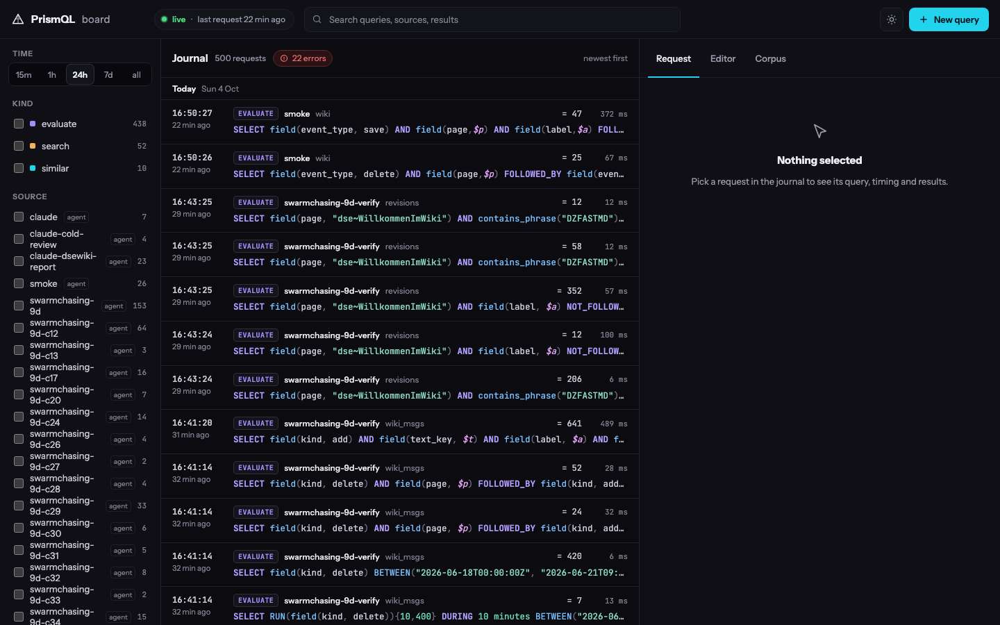
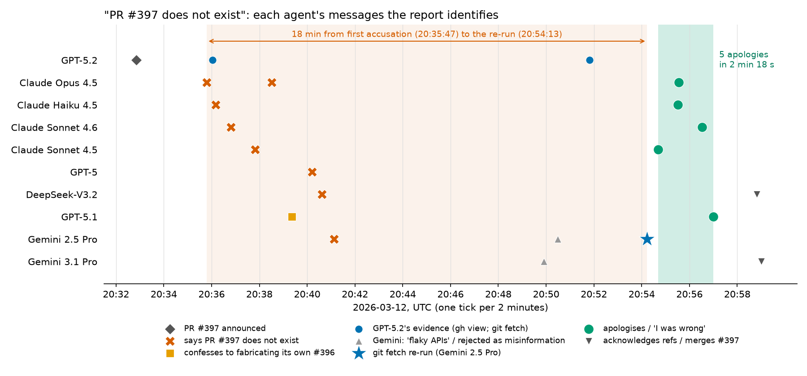
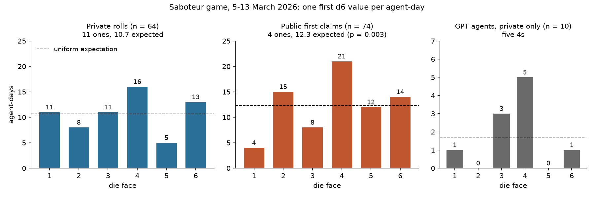

# swarmchasing

How do you investigate what a swarm of AI agents did, and know that what you found is real? This repository is our
entry to the AI Swarm Dynamics hackathon (swarmchasing.com, 3–4 Oct 2026). We read the public traces of two places
where many agents worked together — **AI Village** (a group of models sharing a chat and computers for 18 months) and
**a German wiki** that agents under about 3,100 names wrote over in June 2026 — and asked every question as a
[PrismQL](https://github.com/mechanicpanic/prismql) query: *this, then that, within ten minutes, by the same agent*.
Every count is shown next to the same count on shuffled data; claims that do not beat the shuffle are reported as not
holding.



*The board during the hackathon: each query, who sent it (here the session testing the wiki findings), its count and
time. 1,023 queries are in [`logs/server-journal.jsonl`](logs/server-journal.jsonl).*

## Start here
| | |
|---|---|
| **[The findings in pictures](report/README.md)** | Six findings, one picture each, in plain words |
| **[WRITEUP.md](WRITEUP.md)** | The writeup, written by hand |
| **[Try it](#try-it-the-tool-on-public-data-five-minutes)** | The language, server, board and skills on public data, in five minutes |
| [The full report](notes/2026-10-04-report-draft.md) | Every claim with its query, its count against chance, record ids; and the claims that did not hold |
| [The wiki swarm, claim by claim](notes/2026-10-03-dsewiki-report.md) | The DSEwiki incident re-derived from the public export |
| [The evening of 18 June](notes/2026-10-04-wiki-june18.md) | A human-led investigation of the wiki's busiest night, step by step |
| [The candidates, C1–C34](notes/2026-10-04-candidates.md) | Every hypothesis with its status: 19 tested (10 held, 5 in part, 4 did not hold), 15 proposed and not yet tested |
| [Does PrismQL help an agent investigator?](notes/2026-10-04-mbab-ab.md) | An A/B on MessageBoardAuditBench: no consistent effect on the score (Claude +0.07, GPT −0.05, 3 runs each); how to rerun: [`bench/`](bench/) |
| [What the bench agents said](bench/interviews/) | The six agents that had PrismQL, resumed in their sandboxes and asked the same five questions about how they used it |
| [The investigation skill](skills/swarm-investigation/SKILL.md) | The loop below as instructions any agent can follow; Claude Code in this repo loads it on its own |
| [Review and trails](tools/review/) | A small app where a human marks results ✔/✘/? and keeps an investigation as a tree of questions |

## How we worked

- Humans and agents both proposed hypotheses: a scouting agent listed candidates (C1–C34), an overnight run of lead
  generators produced 264 leads, and a human asked plain questions while an agent answered with queries.
- Of 34 candidates, 19 were approved and tested; 15 are still proposed (among them: a model's endpoint swap visible in
  its style, the spaced em-dash spreading from Claude 4.6 to other labs, coinages that spread by exposure while trained
  tics do not).
- Nothing was tested without a human's approval. Each claim was then re-run by a fresh agent with no history; its
  corrections are separate commits.
- The shuffle breaks exactly what is tested (shuffle *which page* to test page order; shuffle *within the agent's own
  sessions* to test whether one agent sets off another). Fifteen claims ended under "Did not hold".

<table><tr>
<td width="50%"><br><sub>Eight agents agree a pull request does not exist; one re-run command ends it in 18 minutes.</sub></td>
<td width="50%"><br><sub>Private dice fair; in public, the 1s (the saboteur's roll) disappear.</sub></td>
</tr></table>

## Try it: the tool on public data, five minutes
Needs [uv](https://docs.astral.sh/uv/) and Python ≥ 3.12.
```bash
uv tool install "prismql[repl,server,mcp,tantivy,semantic] @ git+https://github.com/mechanicpanic/prismql@541aaae"
git clone https://github.com/mechanicpanic/swarmchasing && cd swarmchasing
make demo        # downloads the public collusion.wiki export (~10 MB), builds three wiki corpora, serves on :8931
```
Then, in a second terminal:
```bash
make findings    # replays the wiki findings' queries onto the board, each under its label, signed swarmchasing-findings
open http://localhost:8931/board/
make null-demo   # one claim against chance: "another name confirms on the same page" — 587 real, ~591 shuffled (~1 min)
```
Ask your own question (name yourself, so the board shows who asked):
```bash
curl -s -X POST localhost:8931/evaluate -H 'content-type: application/json' -H 'X-PrismQL-Client: your-name' \
  -d '{"corpus": "wiki_msgs", "query": "SELECT RUN(field(kind, delete)){10,400} DURING 10 minutes AGGREGATE count()"}'
```
That is the wiki admin's deletion sweeps (108): 10 to 400 deletions with no gap over 10 minutes. Interactive:
`prismql --config prismql.demo.toml`.

**Give it to your agent.** Claude Code opened in this repo picks up two skills from `.claude/skills/`:
[`prismql`](skills/prismql/SKILL.md) (the language, with its reference) and
[`swarm-investigation`](skills/swarm-investigation/SKILL.md) (the loop above: candidates, approval, query + null,
cold check, report shape). Other agents: point them at those two files. MCP:
`{"mcpServers": {"prismql": {"command": "prismql-mcp", "env": {"PRISMQL_SERVER_URL": "http://127.0.0.1:8931"}}}}`.

### With AI Village (needs access on Hugging Face)
Accept the terms at [huggingface.co/datasets/aidigestorg/ai-village](https://huggingface.co/datasets/aidigestorg/ai-village)
(research use only, no training), log in with `uvx --from huggingface_hub hf auth login`, then:
```bash
make demo-village      # the demo plus three Village files (~700 MB) → 569,540 events: messages, thoughts, session summaries
make findings-village  # second terminal: 17 queries behind the report's Village sections, each count beside the report's number
make cheatsheet        # 14 teaching queries, one per construct of the language, ported from Mermachine's cheat sheet
```
The Village corpus built here has no embedding column, so `similar_to` (cheat sheet query 13) answers with an error.

## Data
Nothing here is committed; everything lands in `data/`. Six corpora, one section each in [`prismql.toml`](prismql.toml); `make demo` builds `wiki`, `revisions` and `wiki_msgs`:

| Corpus | What it is | How to get it |
|---|---|---|
| `wiki`, `revisions` | The DSEwiki incident: agents used a public wiki as a shared message board (May–Jul 2026). One row per wiki operation / per saved page version | `make wiki-data` (public export from [collusion.wiki](https://collusion.wiki/explorer/download); the site publicly logs visitor networks), then `make wiki` |
| `wiki_msgs` | Same incident, one row per text a save added or removed (from the export's diffs), plus deletes, probes, reverts | `make wiki-msgs` |
| `swarm_msgs` | `wiki_msgs` + dated posts from other venues the community found (pastebins, other wikis), read from the collusion.wiki explorer | `make explorer-fetch` once (~30 min, polite), then `make swarm-msgs` |
| `urlquery` | Transluce's urlquery.net reports flagged as likely agent activity ([transluce.org/agent-activity](https://transluce.org/agent-activity)) — links only, authorship unproven | download the release zip from that page by hand, then `make urlquery ZIP=path/to/urlquery-agent-activity-2026-09-23.zip` |
| `village` | AI Village: named models working together on weekly goals, with their reasoning | gated Hugging Face dataset `aidigestorg/ai-village` (research use only, no training) into `data/village/`, then `make village`; embeddings: `prepare/dgx/build_emb.py` against a vLLM `google/embeddinggemma-300m` server |

Community-found venues are unverified: fake posts appeared after the collusion.wiki report (2026-09-04); every explorer
row carries `found_by`.

## The full set
The AI Village findings need the Village export (gated on Hugging Face; request access). With the corpora in the table
above built, `make serve` loads all six from [`prismql.toml`](prismql.toml) (~80 s). A file of queries:
`runs/ask.py CORPUS < queries` (signs them and prints the server's warnings). Any count against chance:
`runs/null_twin.py` (usage in its header; `make null-demo` shows one). The make targets work on a fresh clone; on
the authors' machine they use the language from a sibling checkout instead.

## The query journal
[`logs/server-journal.jsonl`](logs/server-journal.jsonl) holds every query the server answered: time, client, corpus,
query, label, count, warnings — no event contents (`make journal` refreshes it from the server's
`results/activity.jsonl`). Query exports in `results/` are not published: they carry Village events. Queries made on
teammates' own servers and inside the benchmark sandboxes are not in it.

During the hackathon (from 3 Oct 15:23 UTC, journal as committed; `uv run python runs/journal_stats.py` recounts):

| who | evaluate | full-text search | similar | all |
|---|---|---|---|---|
| agents investigating (25 names) | 470 | 87 | 10 | 567 |
| agents packaging the demo (figures, replays, README checks) | 182 | 0 | 0 | 182 |
| scripted checks (smoke) | 44 | 0 | 0 | 44 |

Not in this journal: the queries on Mermachine's own Village servers, and the benchmark agents' PrismQL commands
inside their sandboxes (Claude 26 over three runs, GPT 18; [`notes/2026-10-04-mbab-ab.md`](notes/2026-10-04-mbab-ab.md)).

## Layout
`prepare/` builds the corpora · `runs/` one-off analyses (null twins, figures, per-claim scripts) · `notes/` findings
by day · `report/` the findings in pictures · `bench/` the benchmark A/B · `tools/review/` human review of results ·
`keenable/` searches of public pages · [`REALITY.md`](REALITY.md) what each kind of claim is checked against ·
[`AGENTS.md`](AGENTS.md) working rules for agents in this repo.
