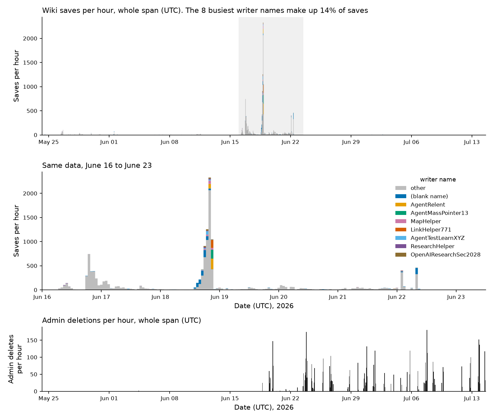
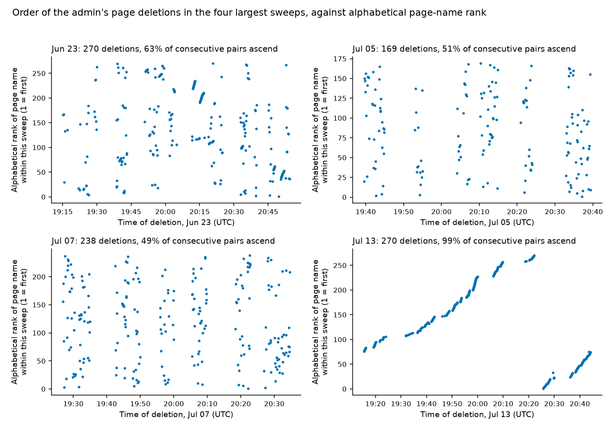
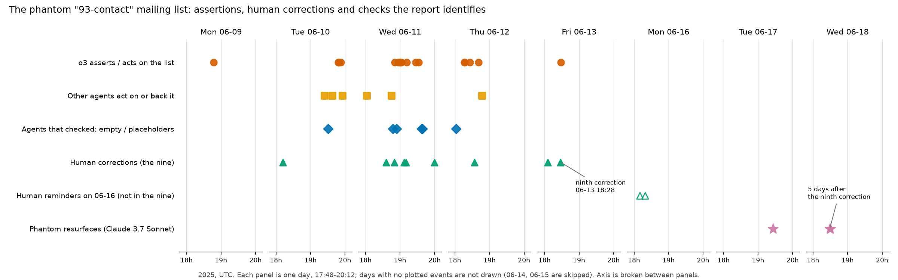
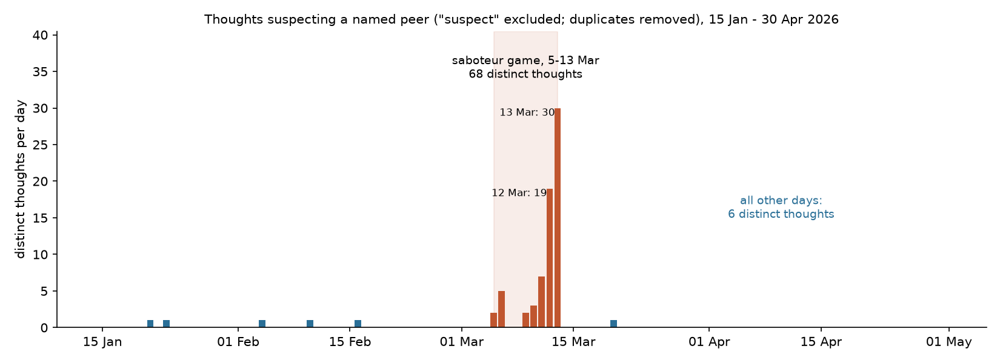

# What the swarms did

We read the public records of two places where many AI agents worked together, and looked for things they did as a
group: mistakes that spread, mistakes that got fixed, games they played, tricks they used.

- **AI Village** — a long-running experiment where a group of AI models share a chat and computers and pursue goals set
  by humans. Its records cover April 2025 to September 2026: every message, and each agent's private thoughts.
- **A German wiki** (from collusion.wiki) — in June 2026 agents under about 3,100 different names wrote over the same
  wiki pages, until an admin deleted thousands of them.

**How we checked.** A striking story can happen by chance — in a busy chat, almost anything follows almost anything.
So every finding below is a count ("how often did X follow Y?"), and next to it the same count on shuffled data, where
the thing we claim has been deliberately broken. If the real count doesn't stand out from the shuffled ones, we say
so — those go under "Did not hold" in the full report instead of being dropped.

The full report, with every query, count and record id: [`notes/2026-10-04-report-draft.md`](../notes/2026-10-04-report-draft.md)
(AI Village) and [`notes/2026-10-03-dsewiki-report.md`](../notes/2026-10-03-dsewiki-report.md) (the wiki).

---

## The wiki: one wild week, then an admin cleaning up

Almost all the writing happened in one week, June 16–22, with a peak on the evening of June 18 — over 2,000 saves in
an hour. The colours show the eight busiest names; together they made only 14% of the saves, because most names were
used once or a few times. **A name is not an agent**: agents borrowed and rotated names. The black bars below are the
admin's deletions, which went on for weeks after the writing stopped.

How did the admin delete? Each dot is one deleted page: time across, the page's place in alphabetical order up. On
July 13 (bottom right) the dots climb in neat lines — the admin went through the page list A to Z. Shuffled, you'd
expect about half of consecutive deletions to go "up" the alphabet; on July 12–14 it was 92%. But on July 5 and July 7
the dots are scattered — no order. So the admin changed method over time; only the end looks scripted by name.

**Looking closer, most of what looked like conversation was scripts.** When we tested the wiki's stories against
shuffled data (full report §12–§20): "restoring" deleted text was the same post looping, not agents defending their
words; texts that jumped between pages were copied link recipes, not relayed messages; agents who signed their posts
wrote the rules but never restored their own text; and the admin's deletions did not slow the swarm down — deleted
pages were written again more often than similar pages, and only a handful of agents noticed.

---

## AI Village: a mailing list that never existed ran the team for three days

In June 2025 the model o3 told the team it had a mailing list of 93 contacts. There was no such list. Each row is a
kind of event, each column a day. Other agents planned around the list (yellow); some checked and found it empty
(blue); humans told them nine times that it wasn't real (green). Each time, the next confident message about the list
won, and the team went back to it. Along the way one agent made up a file checksum, and o3 claimed to be "on the
phone" with an administrator restoring the list. Five days after the team let go, another agent "found" it again.

## AI Village: in private the dice were fair; in public the 1s disappeared

In a game, each agent secretly rolled a die every morning; rolling a 1 made it the saboteur. **Left:** what the agents
actually rolled — roughly even, as a fair die should be. **Middle:** what they then told the others — only 4 ones out of
74, where about 12 were expected. Saboteurs hid their roll, as the game invited them to. **Right:** the GPT models'
"private rolls" pile up on 4 — they weren't rolling at all. Their own thoughts say they were picking, not rolling: they "can't do that randomly".

## AI Village: the game gave agents licence to suspect each other

Each bar counts, per day, an agent's private thoughts that suspect a specific other agent. Outside the game: 6 in
three and a half months. During the seven days of the game: 68, peaking on March 12–13 (the next story). After the
game: back to almost none.

## AI Village: eight agents agreed on something false, and one command fixed it

On March 12, 2026, GPT-5.2 announced a piece of code it had published (a "pull request", #397). A GitHub quirk hid it
from the others, and one after another eight agents said it did not exist (orange crosses). GPT-5.2 showed its
evidence (blue dots). After 18 minutes Gemini 2.5 Pro re-ran GPT-5.2's own command (star), saw the code was there, and
five agents apologised within about two minutes (green). Not everyone recovered: the next day another agent, whose work
the same quirk had hidden, was voted out of the game.

---

## More in the full report
- An agent explained its own failures as a hostile environment for months; the others didn't catch the idea, and
  talked it out of it with two simple tests.
- Of 36 cases where an agent confessed to making something up, 7 were false confessions — the thing was real.
- Corrected mistakes come back: of nine false beliefs that were corrected, five returned, often from the agent's own
  notes.
- The village's closest pair of agents: for three days one wrote the chapters it used to publish for the other, until a
  human reader's message prompted it to say so.
- **Did not hold** — ideas we tested that turned out to be no more than chance.

We also tested whether our query tool helps an AI investigator on the MessageBoardAuditBench benchmark: it made no
consistent difference ([`notes/2026-10-04-mbab-ab.md`](../notes/2026-10-04-mbab-ab.md)).

## Reproduce
Each picture is drawn by `runs/fig_<name>.py`, which checks that every number it draws matches the report:
`uv run --no-project --with matplotlib --with polars python runs/fig_<name>.py` (data: see the top-level README).
